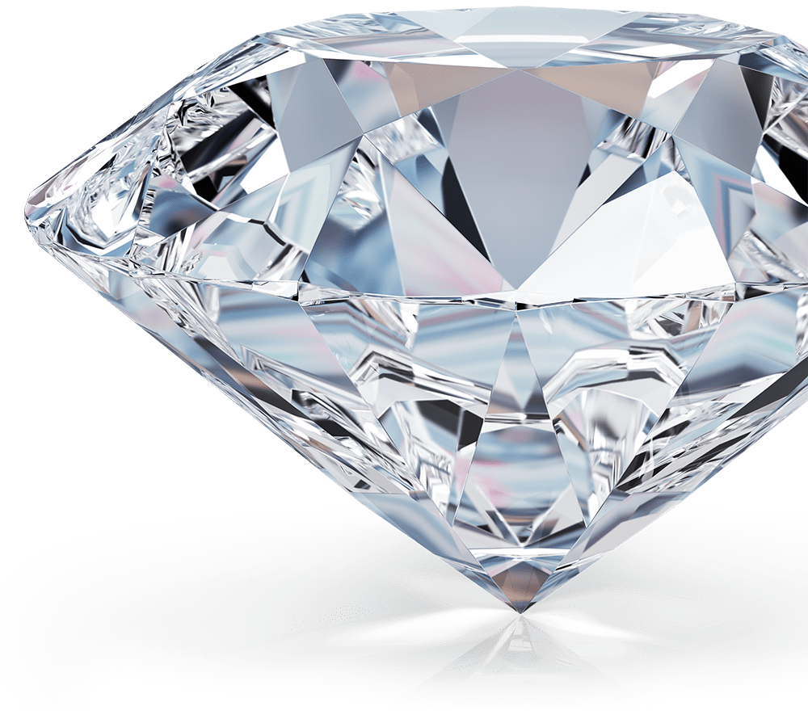

#  Diamond Price Predictor

A machine learning web app that predicts the price of a diamond based on its physical and quality characteristics, built with **scikit-learn** and deployed with **Streamlit**.

**🔗 Live app:** [diamondpricegit-qhnlgme3nny5ymtoxthaxi.streamlit.app](https://diamondpricegit-qhnlgme3nny5ymtoxthaxi.streamlit.app/#diamond-price-predictor)

##  Overview

This project uses the classic [Diamonds dataset from Kaggle](https://www.kaggle.com/datasets/shivam2503/diamonds) (~54,000 diamonds) to train a regression model that estimates a diamond's price from its carat, cut, color, clarity, and dimensions.

The trained model is wrapped in a full **scikit-learn Pipeline** (preprocessing + model) and served through an interactive Streamlit interface, so users can enter a diamond's specifications and get an instant price prediction.

##  How it works

1. **Data cleaning** — rows with invalid dimensions (`x`, `y`, or `z` equal to 0) are removed.
2. **Feature engineering** — `x`, `y`, and `z` are combined into a single `volume` feature (`x * y * z`), and the original dimension columns are dropped.
3. **Preprocessing**
   - `cut`, `color`, and `clarity` are encoded with `OrdinalEncoder`, respecting their natural quality order (e.g. Fair → Good → Very Good → Premium → Ideal).
   - `carat`, `depth`, `table`, and `volume` are scaled with `StandardScaler`.
4. **Model** — a `GradientBoostingRegressor` (`n_estimators=200`, `max_depth=5`, `learning_rate=0.05`) is trained on the processed features.
5. **Deployment** — the fitted pipeline is saved with `joblib` and loaded inside a Streamlit app for real-time predictions.

##  Model performance

| Model | Train R² | Test R² | CV R² | MAE | MSE | RMSE |
|-------|----------|---------|-------|-----|-----|------|
| Gradient Boosting | 0.985198 | 0.981485 | 0.981454 | 279.35 | 296,837.5 | 544.83 |

##  Tech stack

- Python
- pandas / numpy
- scikit-learn
- joblib
- Streamlit

## 📁 Dataset

[Diamonds Dataset — Kaggle](https://www.kaggle.com/datasets/shivam2503/diamonds)
